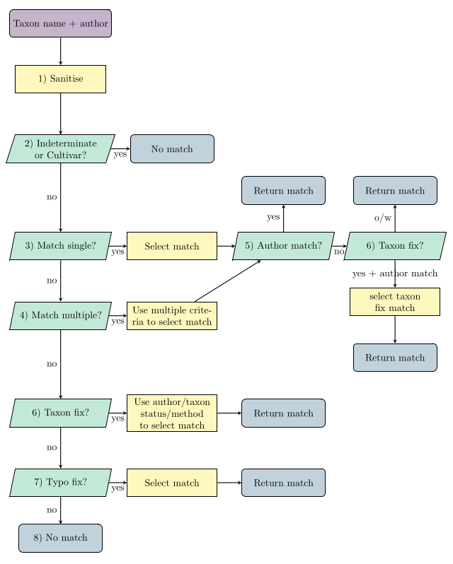

```{r, include = FALSE}
knitr::opts_chunk$set(
  collapse = TRUE,
  comment = "#>"
)
```

```{r setup}
library(LivingCollectionDynamics)
```

```{r, echo = F}
load('data/wcvp_matching_example.rda')
```

*In LivingCollectionDynamics we use an opinionated method to match taxonomic records to enrichment databases (such as [Plants of the World Online](https://powo.science.kew.org) (POWO) or  [IUCN Red List](https://www.iucnredlist.org)) using taxonomic names of plants . Our method is automatic and does not require any manual alterations. Moreover, rather than rely on "fuzzy" matching in difficult cases we apply criteria functions to find the best possible match.* 

# Introduction

Records in a collection are matched via their taxonomic name and taxonomic author/s (if provided). 
A frustration with taxonomic data is that often the taxonomic name itself is frequently not unique - for example [Abies taxifolia](https://powo.science.kew.org/results?q=Abies%20taxifolia). This is often compounded by collections not storing the taxonomic author, resulting in multiple matches. Moreover, since collections data are often converted from old paper records there is a strong possibility that there could be mistakes or typos in the taxonomic name. For example an hybridization marker might be missed out or the wrong infraspecific group used.  

Hence, our method attempts to match taxonomic names to external databases whilst automatically accounting for these common issues. 

Matches of taxonomic records are found by processing the taxonomic name and taxonomic author/s through a matching 'pipeline'. The pipeline is summarized in the flow chart below.  



Each taxonomic record is matched by flowing through the pipeline shown. The purple state indicated the start of the algorithm. blue states correspond to obtaining a match (or no match), yellow to process steps and green to decisions that are made in the algorithm. Steps of the algorithm (numbered in the diagram) are explored in **Parts of the Algorithm** section. 

The matching functions discussed within are wrapped together into the function `enrich_collection()` to enrich a collection with information from WCVP/Red list/BGCI. This can be used to match and enrich your collection without concerning yourself with the method applied. See vignette XX to see the function in action.

For those with interest, we discuss the functions used in matching taxonomic names, how they link together and how they can be used to create a custom-matching algorithm to other databases. Throughout we will mostly concern ourself with matching to WCVP. 

***

# Whole Algorithm

To match to WCVP we use the function `match_collection_to_wcvp()` which performs all the steps of the matching algorithm outlined previously.

We need to define a `collection` with taxonomic names and authors and WCVP database before running the matching algorithm. The `wcvp` database needs to be created using `import_wcvp_names()` in LivingCollectionDynamics. This takes the version of WCVP from POWO and "enhances" it to include extra information required in our matching algorithm.

```{r}
# Load (simplfied) wcvp.
load('data/wcvp_matching_example.rda')

# Create collection database.
ids = 1:7
taxon_names = c('Amsonia ciliata', 'Abies taxifolia', 'Acalypha gracilens f. fraseri',
                "Petunia 'Night Sky'", 'Artemisia pfaffii', 'Acmena hemilamprae', 'Amsonia gracilens')
taxon_authors = c('Walter', 'Desf.', 'Weath.', '', 'Giacom. & Pignatti','L.M.Perry', 'L.')
collection = data.frame(ids, taxon_names, taxon_authors)

# Run matching to wcvp.
match_collection_to_wcvp(collection,
                         wcvp = wcvp,taxon_name_column = 'taxon_names',
                         taxon_author_column = 'taxon_authors',
                         typo_method = 'All')
```

In the example we see that matches are found for 5 out of the 7 inputted taxonomic names (those with a positive `$match`). The values in match correspond to the row number in wcvp of the matched record. Moreover, the output provides `$details_short` and `$details` that describe how the matches occurred. Also outputted are `$match_taxon_name`,  `$original_authors`, `$match_authors` and `$author_check` which can be used to compare authors and taxonomic names between the inputted collection and wcvp. 

`match_collection_to_wcvp()` takes a variety of different inputs to allow flexibility in the matching. For example inputs include

- `do_add_split`: A toggle for whether we search for missing f./var./subsp,
- `do_fix_hybrid`: A toggle for whether we search for hybrid issues,
- `do_rm_autonym`: A toggle for whether we try removing autonyms,
- `typo_method`: The level of typo finding required,
- `do_convert_accepted`: A toggle for whether we convert to accepted names,

 further details can be found in the function's documentation. 

***

# Parts of the Algorithm

In this section we will illustrate each part of the matching algorithm. The database we want to match the collection's taxonomic names to we refer to as the enrichment database. Note that the information of WCVP is contained within two databases named *wcvp_names* and *wcvp_distribution.* In the following matching examples we match to *wcvp_names* which is located at `wcvp$wcvp_names`.

## 1) Sanitise taxon names

This step is used to standardise the format of the taxon name in the original report. The standard format we implement is every character should be lower case except for the first letter of the Genus. We standardise the hybrid sign to be `r '\u00D7'` rather than `x` or `X` (or the rare case of `h` or `H`). We also ensure that the infraspecific level is of the format `f.`, `var.`, `subsp.` or `nothosubsp.`.

Note that the sanitisation should also be performed on the enrichment database. For WCVP this is performed in `import_wcvp_names()`. 

We apply `sanitise_name()` to clean taxonomic names in the collection.

```{r sanitise names}
sanitise_name('TRIGONELLA smyrnaea')
sanitise_name('Halimium X pauanum')
sanitise_name('Aruncus dioicus var acuminatus')
```

***

## 2) Remove cultivars and indeterminantes 

This step sets the match to `-1` for the taxon names we know do not appear in the enrichment database. For WCVP this includes cultivars and indeterminates. We find these taxon names by pattern matching in particular we check for the following patterns.

 - Includes ` sp.`.
 - Includes ` gx `.
 - Includes ` gx`.
 - Includes `'XX'` for some text XX. This is common notation for cultivars.
 - Includes `[`.
 - Begins with `Indet`. 
 - Ends in `indet`.
 - Ends in ` cv`.
 - Includes `cv.`.
 - Includes `unkn`.
 - Ends in `hybrid`.
 - Includes `unknown`.

This is performed using by `no_match_cultivar_indet()`. For these taxon names we set the output message to `(Cultivar or Indeterminate <Do not attempt matching>)`. 

```{r no_match_cultivar_indet}
 taxon_names = c('Acalypha fruticulosa', 'Asclepias sp.', "Abies umbilicata 'Some Cultivar'", 
                 'Ammi copticum cv.')
 no_match_cultivar_indet(taxon_names)
```

***

## 3) Match taxon names to "unique" taxon names in enrichment database

This step matches the taxon names in the collection to the records in the enrichment database that have a "unique" taxonomic name. By this we mean the taxonomic name exists for a single record in the enrichment database and there are not multiple plants with different authors sharing the same taxonomic name. 

As the taxonomic name is unique no further matching decisions are required (e.g authors). 

This step is performed using `match_single()`. 

```{r match single}
# Choose some taxon names
taxon_names = c("Amaranthus graecizans subsp. silvestris", "Amsonia ciliata", "Aristolochia islandica", "Adenocalymma scabriusculum", "Fake name")

# Choose the indices of wcvp which correspond to a unique taxon name using `single_entry`.
wcvp_search_index_single = which(wcvp$wcvp_names$single_entry == T)

# Perform the match
match = match_single(taxon_names = taxon_names,
                     enrich_database = wcvp$wcvp_names,
                     enrich_database_search_index = wcvp_search_index_single,
                     enrich_display_in_message_column = 'powo_id'
                      )
match
```

We see that `match` is a list that contains:

- `$match` the corresponding row in `wcvp$wcvp_names`, if no match return `NA`. 
- `$message` that informs on how the match is obtained, if no match the message is set to `''`.

If we find a match the algorithm  uses `enrich_display_in_message_column`  by default also provides the `powo_id` (e.g. `108437-3`) which can be used to search for the plant directly on POWO's website. This output code in the message can be changed for any column in `wcvp$wcvp_names` using the input `enrich_display_in_message_column`.

```{r match single 2}
match_single(taxon_names = taxon_names, enrich_database = wcvp$wcvp_names,
             enrich_database_search_index = wcvp_search_index_single,
             enrich_display_in_message_column = 'plant_name_id')

```

Moreover, for this function the match can be changed from the row number in `wcvp$wcvp_names` to any column using the input `match_column`, for example 

```{r match single 3}
match_single(taxon_names = taxon_names, enrich_database = wcvp$wcvp_names,
             enrich_database_search_index = wcvp_search_index_single,
             match_column = 'taxon_status',
             enrich_display_in_message_column = 'plant_name_id')

```

***

## 4) Match to non-unique taxon names in enrichment database

By non-unique taxon names we mean names that have multiple entries in the enrichment database (with different authors).
For example suppose our collection contains the taxon name `'Abies taxifolia'`. Searching in WCVP we find 6 records for that taxon name. 

```{r, echo = F}
 DT::datatable(wcvp$wcvp_names[wcvp$wcvp_names$taxon_name == 'Abies taxifolia', c(1:3,5,6)],options = list(scrollX = TRUE))
```


To decide which record best matches the plant in the collection we first try to match on the taxonomic author. 

If it is not possible to match via taxonomic author we can use a custom matching criteria dependent on the enrichment database used. For WCVP one option is to use the taxon status and the accepted plant name to determine the best match. In particular, if all records go to the same accepted plant name then just pick any (if we later push matches to accepted names). Otherwise, use the taxon status where we first use the record if it is accepted, if none are accepted then use synonym.

To obtain the matches we use `match_multiple()` that applies both author matching and custom criterias. 

Below we give an example with *Abies taxifolia* and varying authors.

```{r}
# Choose some taxon names
taxon_names = rep('Abies taxifolia',4)
taxon_authors = c('Desf.', 'Jeffrey', 'Gor', NA)

# Choose the indices of wcvp which correspond to a non-unique taxon name using `single_entry`.
wcvp_search_index_mult = which(wcvp$wcvp_names$single_entry == F)

# Perform the match
match = match_multiple(taxon_names = taxon_names,
                       taxon_authors = taxon_authors,
                       enrich_database = wcvp$wcvp_names, 
                       enrich_database_search_index = wcvp_search_index_mult,
                       matching_criterion = LivingCollectionDynamics::additional_wcvp_matching,
                       enrich_plant_identifier_column = 'plant_name_id',
                       show_progress = FALSE)
match
```
We see that without an author we cannot determine a match (`$match = -2`) this is due to having to use taxon status and accepted plant name id for the matching criteria and these cannot select a single record (accepted plant name ids not all the same, multiple best taxon status *synonym*). When the author was provided we found matches. For *'Desf.'* the author matches exactly a record in WCVP and *Jeffrey*, *Gor* both partially match *J.Jeffrey ex Gordon & Glend.*.

By default `match_multiple()` depends `match_authors()` and `no_additional_matching()` which performs author matching and custom matching respectively. Above we use `additional_wcvp_matching()` which performs custom matching for taxon_status and accepted plant name id. These can be changed using the inputs `matching_authors` and `matching_criterion`. 

In the following subsections we describe author matching and custom matching. 

### Matching using taxonomic author.

Author matching is performed using `match_authors()`, which takes both the author from the collection and the authors from the enrichment database to compare. The function will initially try to match the author exactly. If there are no exact matches it will then look for partial matches (authors with shared words). 

Example of an exact author match.

```{r match_authors}
# Restrict wcvp to only taxon_name = 'Abies taxifolia'
wcvp_Abies_taxifolia = wcvp$wcvp_names[wcvp$wcvp_names$taxon_name == 'Abies taxifolia',]

# Get author name from the collection and author names from wcvp.
collection_author = 'Desf.'
wcvp_authors = wcvp_Abies_taxifolia$taxon_authors

# Match via authors
matched_info = match_authors(collection_author, wcvp_authors)
matched_info

# Restrict wcvp_Abies_taxifolia to only matched authors
 DT::datatable(wcvp_Abies_taxifolia[matched_info$wanted,c(1:3,5,6)],options = list(scrollX = TRUE))
```

Example of a partial match.

```{r match_authors 2}
#Change author name for the collection
collection_author = 'Jeffrey'

# Match via authors
matched_info = match_authors(collection_author,wcvp_authors)
matched_info

# Restrict wcvp_Abies_taxifolia to only matched authors
DT::datatable(wcvp_Abies_taxifolia[matched_info$wanted,c(1:3,5,6)],options = list(scrollX = TRUE))
```

By default partial matching chooses the records that shares the most words with the author given in the collection (by default the input `partial_method = 'most words'`) this can be changed to chose any record with any level of partial matching using `partial_method = 'any words'`.

### Custom matching.

Custom matching is performed by the so called `matching_criteria()` function, this takes an extract of the enrichment database (often those with idenitical taxon names) and attempts to choose the best record using some criteria and returns the rows which correspond to the best match. 

To allow flexibility this function can be passed as an input `matching_criteria` to `match_multiple()`. The package contains two custom matching criteria `no_additional_matching()` and `additional_wcvp_matching()`.  By default `no_additional_matching()` is used. 

`no_additional_matching()` always returns all rows with the message *'unclear, do not match'*. This corresponds to not applying custom matching.

`additional_wcvp_matching()` matches records by first looking at `accepted_plant_name_id` of the WCVP records passed to it, if all the accepted plants names are the same the function returns an accepted taxon status row or if non of these exists just the first row. If there are differences in `accepted_plant_name_id` then the function looks at `taxon_status` and returns any rows that are accepted, and if non are accepted any that are synonyms. 

A couple examples are given below.

```{r other matching}
# Apply to first 3 rows of taxon name  = Abies_taxifolia (i.e all have the same accepted plant name id)
additional_wcvp_matching(wcvp_Abies_taxifolia[1:3,])

# Apply to rows 1,4,6 of taxon name  = Abies_taxifolia (i.e differing accepted plant name ids only only has taxon status = synonym)
additional_wcvp_matching(wcvp_Abies_taxifolia[c(1,4,6),])

# Apply to rows 1,4,6 of taxon name  = Abies_taxifolia (i.e differing accepted plant name ids all taxon status = synonym)
additional_wcvp_matching(wcvp_Abies_taxifolia[c(1,5),])

```

#### Creating new custom matching criteria
To create a new custom matching function all we need a function that takes an extract of the enrichment database as an input and returns a list with `$row` of the best rows and `$message` detailing what the custom matching did. 

Within *wcvp_names* there is a column called *publication_author* and suppose we decide if we cannot match via author we want to use records that have a *publication_author*. We create a new matching criteria function called `wcvp_publication_matching()`.

```{r}
wcvp_publication_matching <- function(enrich_database_extract, message = ''){
  # Sanity checks.
  if(!'publication_author' %in% names(enrich_database_extract)){
    stop('No column called publication_author in enrichment database')
  }
  
  # Find the records with non-NA publication_author.
  rows = which(!is.na(enrich_database_extract$publication_author))
  
  # If there are records with non-NA publication_author return these rows.
  if(length(rows) > 0){
    message = paste0(message, '(Choose record with publication_author)')
    return(list(row = rows, message = message))
  }
 
  # all publication_author are NA. 
  message = paste0(message, '(All publication_author are NA)')
return(list(row = 1:nrow(enrich_database_extract), message = message))
}
```

Check that the function works as hoped. 

```{r}
# publication_authors in wcvp_Abies_taxifolia.
wcvp_Abies_taxifolia$publication_author
# New matching criteria.
wcvp_publication_matching(wcvp_Abies_taxifolia)
```

We see that the function returns the forth row which corresponds to the only *Abies taxifolia* record in WCVP with publication author. 

So we can now apply this matching criteria in the function `match_multiple()`.

```{r}
# Perform the match
match = match_multiple(taxon_names = taxon_names,
                       taxon_authors = taxon_authors,
                       enrich_database = wcvp$wcvp_names, 
                       enrich_database_search_index = wcvp_search_index_mult,
                       matching_criterion = wcvp_publication_matching,
                       enrich_plant_identifier_column = 'plant_name_id',
                       show_progress = FALSE)
match
```
We see that the change of matching criterion now finds a match for the forth record, whereas previous this record could not be matched based on taxon status or accepted plant name id.

#### Combining custom matching criterias
An advantage of the approach used is that it is easy to combine multiple custom matching criterias into a new criteria function.

```{r}
wcvp_combined_custom_matching <- function(enrich_database_extract, message = ''){
  ### Taxon status and accepted name id matching.
  match_A = LivingCollectionDynamics::additional_wcvp_matching(enrich_database_extract, message)
  
  # If only one record remains after additional_wcvp_matching return it
  if(length(match_A$row)==1){
    return(match_A)
  }
  
  ### update extract and message prior to publication author matching
  enrich_database_extract = enrich_database_extract[match_A$row,]
  message = match_A$message
  
   ### publication author matching.
  match_B = wcvp_publication_matching(enrich_database_extract, message)
  
  return(match_B)
}

```

Then applying the function onto the same cases as before

```{r}
# Apply to first 3 rows of taxon name  = Abies_taxifolia (i.e all have the same accepted plant name id)
wcvp_combined_custom_matching(wcvp_Abies_taxifolia[1:3,])

# Apply to rows 1,4,6 of taxon name  = Abies_taxifolia (i.e differing accepted plant name ids only only has taxon status = synonym)
wcvp_combined_custom_matching(wcvp_Abies_taxifolia[c(1,4,6),])

# Change the forth taxon_status to synonym so that custom matching will first restrict to synonym then choose the record with publication author.
wcvp_Abies_taxifolia$taxon_status[4] = 'Synonym'
wcvp_combined_custom_matching(wcvp_Abies_taxifolia)
```

## 5) Check original author names compared to matched authors

Another quirk of matching taxon names is that occasionally it is possible to find a match where the taxon names are identical with differing authors where a slight change to the taxon name will yield a match with identical authors. For example suppose our collection has *Salix fragilis* with author *L.*, in WCVP we have the following:

```{r, echo = F}
DT::datatable(wcvp$wcvp_names[grepl('Salix',wcvp$wcvp_names$taxon_name),c(1:3,5,6)],options = list(scrollX = TRUE))
```

We see in this case if we have a matching criteria that can identify one of the first three records as the best match then without additional checks we would go to an incorrect match.

To account for this pitfall after the initial matching by taxonomic name if the authors do not agree then we search for fixes in the taxonomic name which have an improved author match. 

We use `author_check()` to compare the authors, which will output one of

- `Exact` match, the authors are identical.
- `Partial` match, the authors are split into words and at least one word is contained in the other (i.e a word in original author is in matched author, or vice versa).
- `Different`, the authors are not in the above categories. 


```{r}
author_check('Oliv.','Oliv.')
author_check('(Bong.) D.Don (Piper) C.L.Hitche','(Piper) C.H.Hitchc.')
author_check('L.','(W.D.J.Koch) Arcang.')
```

For those with `author_check()` equal `Different` we run `match_all_issue()` which attempts to fix the taxon name and find matches. If a match if found with this method and the author check improves to `Partial` or `Exact` we update the match to the record with fixed taxon name. 

## 6) Fix the taxon name

If we get to this stage in the algorithm either:

- The taxonomic name cannot be found in the enrichment database, or

- The taxonomic name has been found but the authors are different. 

Therefore, we want to make small adjustments to the taxonomic name and see if any of these adjusts leads to a name found in the enrichment database. 

The changes we make in this step are to try common mistakes in the taxonomic name which includes:

- Change/Add/Remove the infraspecific levels.
- Change/Add/Remove hybridisation markers.
- Removing autonyms.

The fixing is performed by `match_all_issue()`.

```{r}
taxon_names = c('Salix fragilis', 'Acalypha gracilens f. fraseri', 'Abies alba var. alba')
taxon_authors = c('L.', '(Müll.Arg.) Weath.', 'Mill.')
match_all_issue(taxon_names = taxon_names,
                taxon_authors = taxon_authors,
                enrich_database = wcvp$wcvp_names,
                enrich_plant_identifier_column = 'plant_name_id'
)
```
We see that for each taxon name a fixed version is found and it is put forward as a match. 

Each method of finding fixed taxon names has a separate function, namely `try_fix_infraspecific_level()`,  `try_fix_hybrid()` and `try_rm_autonym()`. Each of these functions creates potential new taxon names and checks whether they are in the enrichment database's taxon names.

```{r}
# Get the taxon names in the enrichment database
enrich_database_taxon_names = unique(wcvp$wcvp_names$taxon_name)

# Try and find fixed taxon names via fixing  infraspecific level.
try_fix_infraspecific_level(taxon_names = c('Amaranthus graecizans var. silvestris',
                                            'Aesculus × rubicunda whitleyi',
                                            'Abelia serrata gymnocarpa'),
                            enrich_database_taxon_names = enrich_database_taxon_names)

try_fix_hybrid(taxon_names = c('Aesculus rubicunda var. whitleyi',
                                            'Acer + pseudocreticum',
                                            'Salix fragilis'),
                            enrich_database_taxon_names = enrich_database_taxon_names)

try_rm_autonym(taxon_names = c('Adina nobilis var. nobilis'),
                            enrich_database_taxon_names = enrich_database_taxon_names)
```

We then combine the names given by each method and find the best match via author matching and custom matching. 

If those methods yield multiple potential matches we then select via the method used to get the fixed taxon name. In particular, we select first records obtains by `try_fix_infraspecific_level()` then `try_fix_hybrid()` and finally `try_rm_autonym()`. 


## 7) Typo finding

If a taxon name reaches this stage then a match has not being found and neither could fixing the taxon name yield a match. 

Therefore, our final attempt to find a match is to search for simple or common typos in the taxon name. Typos are found in three ways:

- searching a data frame of known typos,
- searching for common issues found in the taxon name,
- searching for a single letter change in the taxon name.

Once a typo is found the corresponding record is selected. I.e. the first typo is selected and no further search is done.

`match_typos()` performs the typo searching and matching.

```{r}
taxon_names = c('Artemisia × pfaffi', 'Adina racemosae')
taxon_authors = c('Giacom. & Pignatti', '(Siebold & Zucc.) Miq.')

match_typos(taxon_names, taxon_authors,
            enrich_database = wcvp$wcvp_names,
            typo_method = 'All',
            enrich_display_in_message_column = 'powo_id')
```
This step can be computationally expensive, therefore we include the input `typo_method` which allows 3 different levels of typo checking.`typo_method = "All"` is the maximum level that performs all typo checking. `typo_method = "Data frame + Common"` is the intermediate level that only tries the known typos and common fixes. `typo_method = "Data frame only"` is the minimum level that only checks whether typos are found from in the known typos data frame.

Below we outline the three methods to finding typos.


### Searching a data frame of original names and fixed names

In our package we include a data frame of typos `LivingCollectionDynamics::typo_list`. This contains `r format(nrow(LivingCollectionDynamics::typo_list), big.mark =',')` typos that we have found in collections.

We first find typos by checking against `LivingCollectionDynamics::typo_list`.

```{r}
head(LivingCollectionDynamics::typo_list)
```

### Searching for common issues found in taxon names

If we have not found a match in the typo list we then check for common issues found in taxon names. In particular we check for the following changes at the end of the species name. 

- 'i' <-> 'ii'
- 'i' <-> 'ae'
- 'a' <-> 'um'
- 'a' <-> 'us'
- 'ae' <-> 'eae'
- 'e' <-> 'is'
- 'is' <->'e'
- 'us' <-> 'is'
- 'ense' <->'iense'
- 'oides' <-> 'ioides'
- 'orum' <-> 'iorum'

We also check the following patterns anywhere in the taxon name:

- 'i' <-> 'ae'

### Searching for a single change in letter

Our final stage performs a larger check for a change in single character. This involves:

- Checking removing a single character from the taxon name in all positions.
- Checking adding a single character (a-z and '-') in all positions.
- Changing a current letter to any character in a-z in all positions.

***

## Update matches to accepted names (WCVP only)

To update taxon names to their accepted form we use the field `accepted_plant_name_id` in WCVP. If the `accepted_plant_name_id` does not match `plant_name_id` then we update the match to correspond to the accepted plant. This is performed by the function `convert_to_accepted_name()` in LivingCollectionDynamics, which takes in the current state of the matches and updates to the accepted form. An example is given below.

```{r}
taxon_names = c('Adina nobilis', 'Acalypha gracilens var. fraseri',
                'Andira zehntneri')

# Get the original match.
match = match_single(taxon_names,wcvp$wcvp_names,wcvp_search_index_single,
                     enrich_display_in_message_column = 'powo_id')
match

# Try to convert to accepted name.
new_match = convert_to_accepted_name(match$match, wcvp$wcvp_names)
new_match

# Putting the messages together.
messages = paste0(match$message, new_match$message)
messages
```

We see that the first two taxon names go to an accepted form and the third does not. This is shown by both `$match` remaining the same and an empty `$message` after running `convert_to_accepted_name()`.

We can check the accepted name by using the codes provided in the message on POWO's website. This is done by changing the last part of the URL. For example `Adina nobilis` can be found at the address https://powo.science.kew.org/taxon/urn:lsid:ipni.org:names:742921-1. We see that this is indeed a synonym of Adina racemosa.

***

## 8) Set remaining to not matched

If there are any unmatched taxon names after all the steps mentioned previously then their match index is set to `-3`, and their message equals `(No match found)`.  

***
